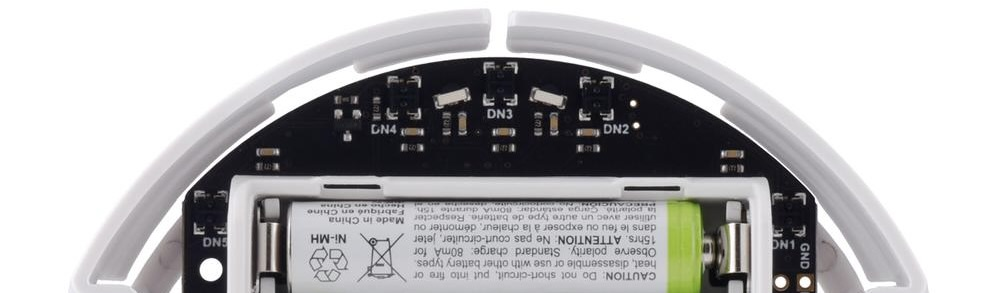

# Mini projet 2025

## I) Objectifs

Ce projet avait pour but de concevoir un système embarqué autonome à partir du robot **Pololu 3pi+ 32U4**, équipé d’un microcontrôleur **ATmega32U4**. Les objectifs finaux étaient :

- **Suivre une ligne noire** tracée au sol à l’aide de capteurs de réflectance.

- **Estimer en temps réel la position** du robot (X, Y) à partir des encodeurs des roues.

- **Revenir automatiquement au point de départ** une fois le parcours terminé, sans repasser par la ligne.

J’ai pu mettre en œuvre les trois fonctions clés d’un système embarqué : l’acquisition (lecture des capteurs et des encodeurs), le traitement (calcul de la position à partir des déplacements), et la commande (pilotage des moteurs selon l’orientation et la position estimée).

En pratique, le robot suit correctement la ligne (mise en place d'un correcteur Proportionnel Intégral) et met à jour sa position X et Y tout au long du parcours. En revanche, faute de temps, je n’ai pas pu finaliser l’implémentation du retour au point de départ. Le calcul de la distance et de l’orientation était prêt, mais la phase de déplacement inverse n’a pas pu être testée ni intégrée complètement.

## II) Mise en œuvre

### 1 - Les macros

Pour faciliter la manipulation des registres du microcontrôleur ATmega32U4, j’ai défini quelques macros utilitaires permettant de gérer individuellement les bits. Ces macros rendent le code plus lisible et évitent les répétitions lors de la configuration des ports ou du traitement des interruptions :

- **set_bit** : mettre un bit à 1
- **clear_bit** : mettre un bit à 0
- **toogle_bit** : inverse un bit
- **test_bit** : teste si un bit est à 1

### 2 - Utilisation des capteurs



Le robot est équipé de 5 capteurs infrarouge nommés DN1, DN2, DN3, DN4 et DN5.

#### <ins>Lecture
Chaque capteur est composé de trois éléments :

- une LED infrarouge (commandée collectivement par la ligne EMIT)

- un phototransistor

- un condensateur (2,2 nF)

Principe : plus la surface en face du capteur est claire, plus la diode émet de lumière réfléchie, et plus le phototransistor est passant. Cela permet de charger plus rapidement le condensateur. On mesure donc le temps de charge du condensateur que l'on stocke dans une variable "count", plus count est grand plus la surface est sombre.

La fonction suivante permet de renvoyer la valeur d'un capteur :

```
int read_reflectance_sensor(volatile uint8_t* DDRx, uint8_t DDxn,
                            volatile uint8_t* PORTx, uint8_t PORTxn,
                            volatile uint8_t* PINx, uint8_t PINxn);
```
#### <ins>Calibration
Comme **les valeurs brutes dépendent fortement de la lumière ambiante**, une calibration est nécessaire. Pendant 4 secondes au démarage du robot, on lit les valeurs minimales et maximales atteintes par chaque capteur : 
```void calibrate_sensors(MinMax* mm);```

Puis on les stocke dans une structure : 
``` 
typedef struct {
    int min_C2, max_C2;
    int min_C4, max_C4;
    int min_C1, max_C1;
    int min_C3, max_C3;
    int min_C5, max_C5;
} MinMax;
```

#### <ins>Normalisation des valeurs brutes

Après calibration, on applique une **transformation linéaire** pour ramener chaque mesure entre 0 (le plus faible reflet observé) et 1000 (le plus fort). Cela facilite :

- l’interprétation des données dans le code

- la comparaison symétrique gauche/droite (important pour le calcul d’erreur)

- la portabilité du code (réutilisable dans un autre environnement lumineux)

Dans la boucle principale on appelle la fonction `read_all_sensors_normalized(&mm, capteurs);` , elle permet de renvoyer les valeurs normalisées de chaque capteur sous la forme d'un tableau ( _capteurs[5]_ ).

#### <ins>Suivi de la ligne

Pour suivre une ligne noire sur fond blanc, j'utilise deux capteurs latéraux (les capteurs 2 et 4). L'idée est simple : si la ligne est centrée, les deux capteurs doivent mesurer la même chose. Sinon, une différence apparaît, que j'utilise comme erreur.

L'erreur est calculée comme la différence entre les deux capteurs : `error = capteur2 - capteur4`. Si la ligne est plus à gauche, le capteur 2 voit plus de noir que le capteur 4 : erreur positive.
Si la ligne est à droite : erreur négative.

Cela permet d'utiliser une commande PI incrémentale pour corriger la trajectoire (voir section suivante).

### 3 - Contrôle des moteurs

Le robot se déplace à l’aide de deux moteurs à courant continu, un de chaque côté. Leur contrôle se fait en agissant sur :

- Le sens de rotation (horaire ou antihoraire via `PB1` et `PB2`)

- La puissance transmise (via `OCR1A` et `OCR1B`)

On commence par initialiser tous les pins/registres necessaires au bon fonctionnement des moteurs avec `void init_pins_PWM_motor()` et on choisi une vitesse de reférence pour notre robot : `#define SPEED_REFERENCE 20`.

#### <ins>Tourner
Pour effectuer un virage à 90°, on utilise une rotation en pivot : un moteur avance, l'autre recule.

- `void tourner_a_droite_90();` fait reculer le moteur droit et avancer le gauche pendant 780 ms.

- `void tourner_a_gauche_90();` fait l’inverse.

L'arrêt se fait en mettant la puissance à zéro sur les deux moteurs. Ces fonctions permettent de faire des virages précis sans avoir à lire les capteurs.

#### <ins>Suivi de la ligne
Si les fonctions précédentes permettent d'effectuer des virages fixes, le suivi fluide d'une ligne noire nécessite un contrôle plus fin.  c'est ici qu'intervient la **régulation PI** (Proportionnelle + Intégrale). A partir de l'erreur definie dans la section précédente on peut calculer les commandes à injecter dans nos moteurs permettant de corriger la trajectoire au cours du temps : 

$$
\text{Commande} = K_P \cdot \text{erreur} - \text{erreur}_{\text{prec}} + K_I \cdot \text{erreur}_{\text{prec}} \cdot (t - t_{\text{prec}}) + \text{commande}_{\text{prec}}
$$

- Le terme proportionnel `KP` corrige rapidement les écarts.

- Le terme intégral `KI` compense les erreurs persistantes dans le temps.

- Δt est obtenu à partir du timer `TCNT1` (avec un pas de 62,5 µs).

La commande est ensuite utilisée pour **ajuster les vitesses des moteurs** :
```
int speed_right = SPEED_REFERENCE + command_int;
int speed_left = SPEED_REFERENCE - command_int;
```
Les vitesses sont ensuite bornées entre 0 et 20 pour éviter les dépassements, puis appliquées via les registres `OCR1A` (moteur droit) et `OCR1B` (moteur gauche).

### 4 - Calcul de la distance parcourue

Pour estimer la distance parcourue par le robot, une structure Position est utilisée pour suivre ses coordonnées $(X, Y)$ dans l’espace. 
```
typedef struct {
    int X, Y;
} Position;
```

Le suivi repose sur les interruptions déclenchées par les encodeurs des roues, qui permettent de détecter chaque mouvement de rotation. Le capteur sur la roue droite est branché sur `INT6` et est configuré pour se déclencher à chaque front montant ou descendant, à chaque déclenchement :
- Lit les états actuels des signaux A et B de l’encodeur.

- Déduit le sens de rotation (avancer ou reculer).

- Met à jour la position (X, Y) en fonction de l’orientation actuelle

L’orientation est modifiée manuellement après chaque virage à 90°, détecté grâce aux capteurs latéraux (D1 et D5):
`orientation = (orientation + 90) % 360;`si on tourne à droite, `orientation = (orientation + 270) % 360;`si on tourne à gauche.

### 5 - Retour au point de départ

#### <ins>Implémentation actuelle
Lorsque le robot détecte la fin de la ligne (i.e. lorsque tous les capteurs lisent une valeur inférieure à 100 pendant une durée suffisante), il enclenche une procédure de retour au point de départ. La position courante du robot est estimée à l’aide de la `volatile Position pos = {0, 0};`.

À l’instant de la détection de fin, on commence par réorienter le robot vers sa direction initiale (vers l’axe X positif), en effectuant des rotations de 90° jusqu’à ce que l’orientation atteigne 0°. Ensuite la fonction `void return_to_start(int XTOT, int YTOT)` calcule :

- la distance à parcourir jusqu’au point de départ

- l’angle absolu nécessaire pour s’orienter vers ce point

puis déplace le robot jusqu'à sa position initiale avec les fonctions `void tourner_temps(int temps);`et `void avancer_temps(int temps);`. Le paramètre `temps` étant calculé de manière proportionnelle à partir des données déjà connues ( donc pas très précis ).

#### <ins>Améliorations envisagées
Pour améliorer la précision du retour au point de départ, j'avais prévu d'exploiter une interruption déclenchée par les tours du moteur gauche. L’idée serait de fiabiliser la mesure de distance parcourue, en se basant non plus sur une estimation temporelle, mais sur le comptage effectif de l'avancement du robot.

l'idée serait de modifier la fonction `return_to_start(int XTOT, int YTOT)` afin qu’elle ne déclenche pas directement les moteurs, mais qu’elle calcule uniquement les paramètres de retour (angle et distance), et les stocke dans une structure dédiée :
```
typedef struct {
    int CAP, DISTANCE;
} CheminRetour;
```

Dans le main, on pourrait ensuite :

- Appeler `tourner_temps(...)` pour orienter le robot ;

- Lancer le déplacement avant ;

- L’arrêter uniquement lorsque le compteur `count_retour` (incrémenté par une interruption sur la rotation du moteur gauche) atteint la valeur DISTANCE.

Ce changement permettrait d’éviter les conversions distance/temps souvent imprécises, en se reposant sur une mesure directe.
